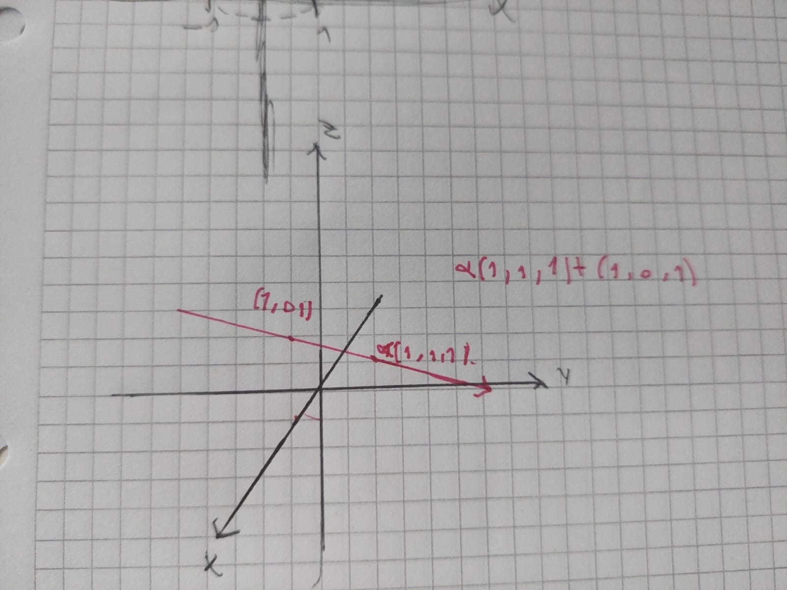
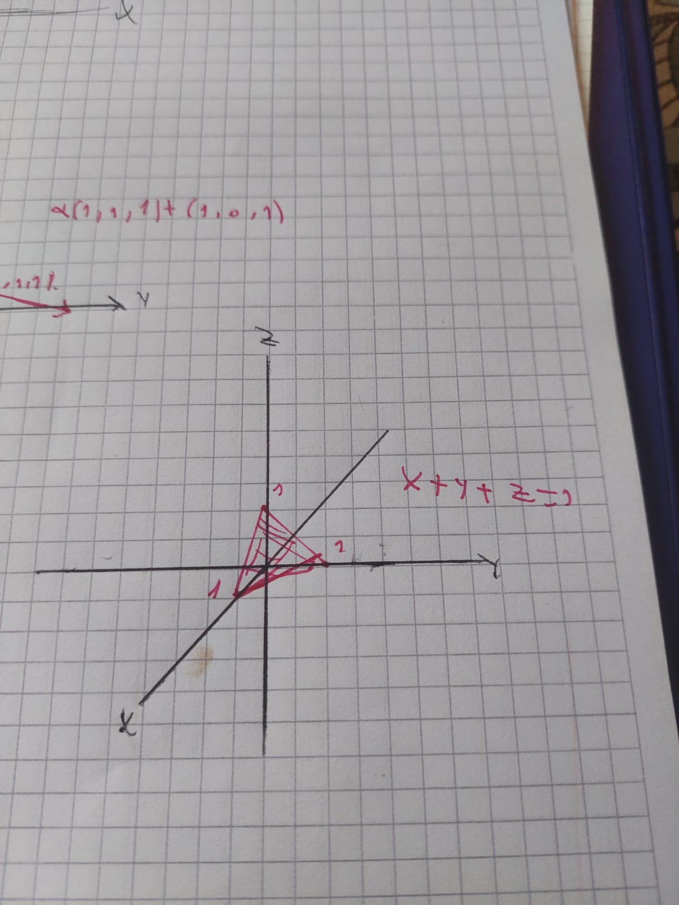
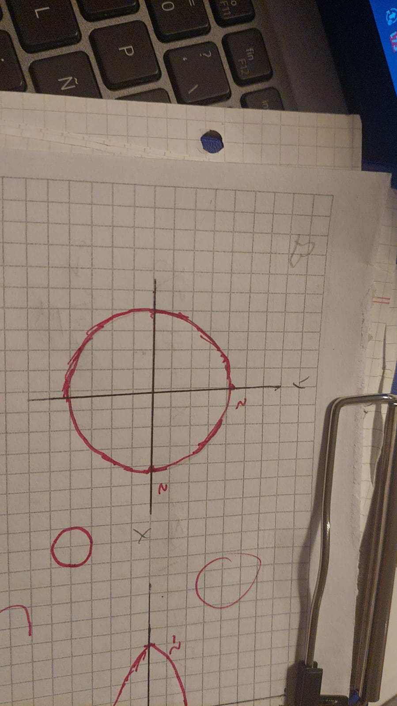
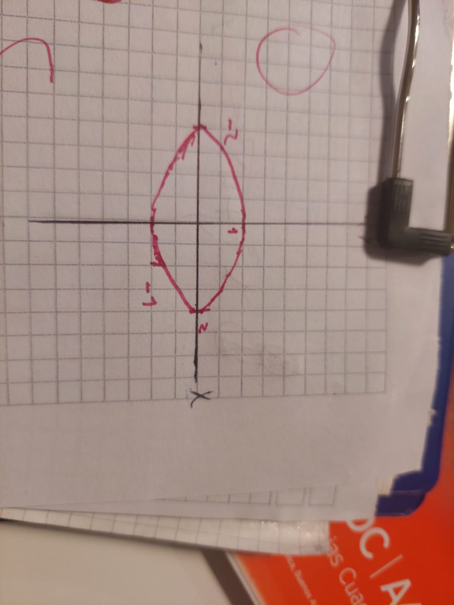
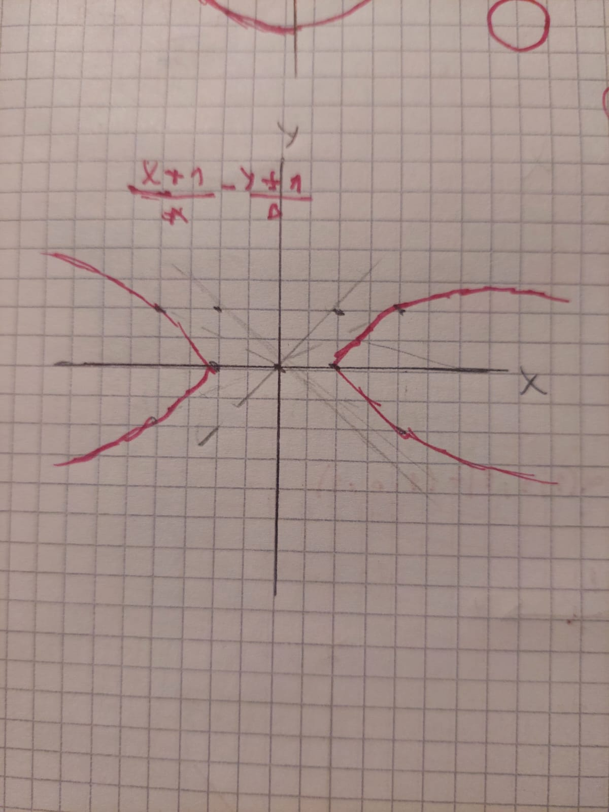
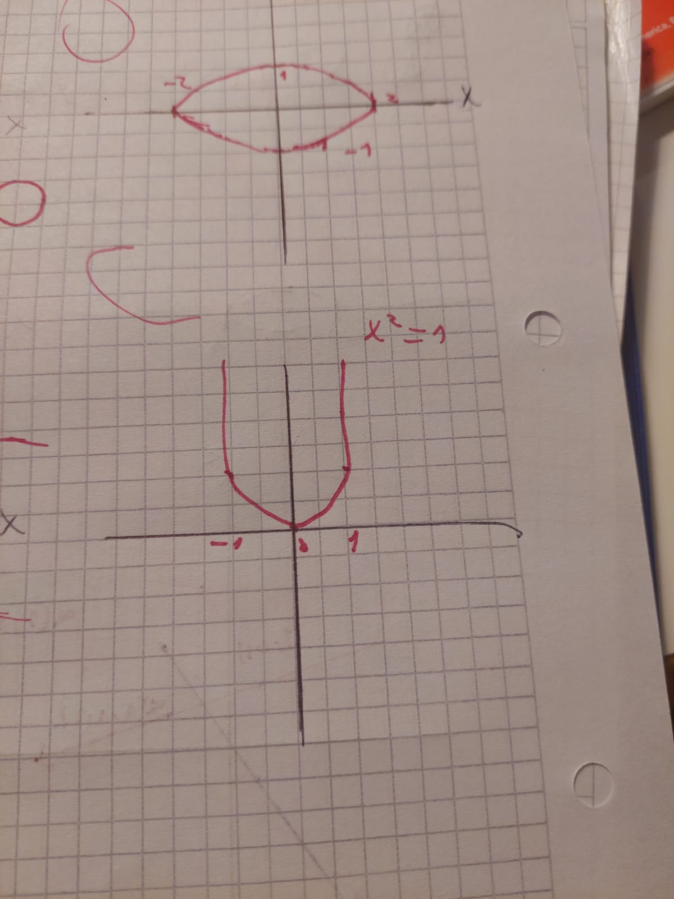
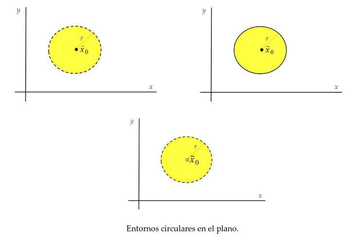
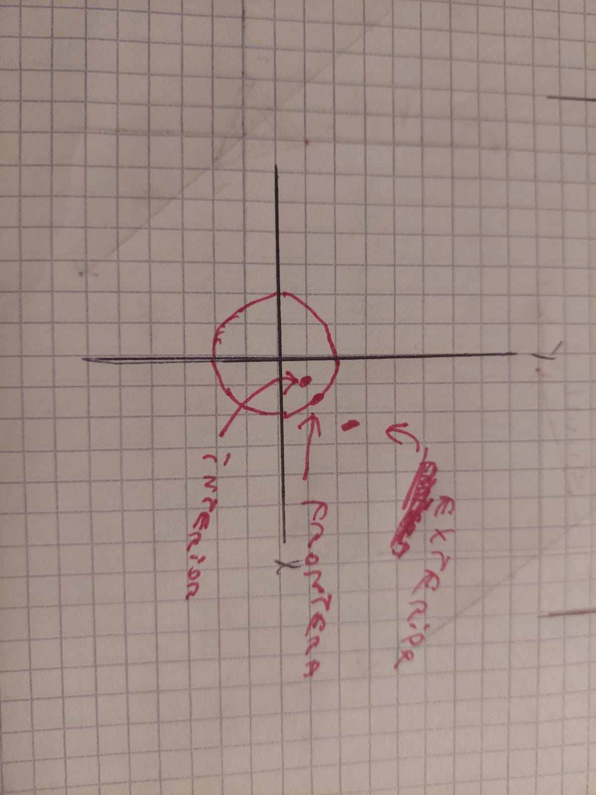

# unidad 1

## proposito de estos resumenes

el objetivo es aunar todos los conocimientos teoricos de analisis matematico 2, en un solo documento, con el fin de facilitar el estudio y la revision de los temas mas importantes.

## conjunto 

un conjunto es una coleccion de objetos, llamados elementos, que pueden ser cualquier cosa: numeros, personas, letras, etc. los conjuntos se representan con llaves {} y los elementos se separan por comas. por ejemplo:

```math
A = {1, 2, 3, 4, 5}
```

## subconjunto

un subconjunto es un conjunto que esta contenido dentro de otro conjunto. por ejemplo, si tenemos el conjunto A = {1, 2, 3, 4, 5} y el conjunto B = {1, 2, 3}, entonces B es un subconjunto de A, porque todos los elementos de B estan en A. se denota como B ⊆ A.

## conjunto vacio

el conjunto vacio es un conjunto que no contiene ningun elemento. se denota como ∅ o {}.

## recta

la recta es un conjunto de puntos que se extiende infinitamente en ambas direcciones. se puede representar con una ecuacion lineal, como y = mx + b, donde m es la pendiente y b es la ordenada al origen, la que nos interesa es la expresion vectorial de la recta, que se puede escribir como:

```math
r:(x,y) = (x0,y0) + t(vx,vy)

r:(x,y,z) = (x0,y0,z0) + t(vx,vy,vz)
```

donde (x0,y0) es un punto en la recta, (vx,vy) es un vector director de la recta, y t es un parametro que puede tomar cualquier valor real. esta forma de representar la recta se llama forma paramétrica o forma vectorial de la recta.



## plano

el plano es un conjunto de puntos que se extiende infinitamente en todas las direcciones. se puede representar con una ecuacion lineal, como ax + by + cz = d, donde a, b, c y d son constantes. la forma vectorial del plano se puede escribir como:

```math
P:(x,y,z) = (x0,y0,z0) + s(v1x,v1y,v1z) + t(v2x,v2y,v2z)
```
donde (x0,y0,z0) es un punto en el plano, (v1x,v1y,v1z) y (v2x,v2y,v2z) son dos vectores directores del plano, y s y t son parametros que pueden tomar cualquier valor real. esta forma de representar el plano se llama forma paramétrica o forma vectorial del plano, la que nos compete es la forma normal del plano, que se puede escribir como:

```math 
ax + by + cz = d
```



donde a, b y c son las componentes del vector normal al plano, y d es la distancia del plano al origen. esta forma de representar el plano se llama forma normal del plano.

## espacio

el espacio es un conjunto de puntos que se extiende infinitamente en todas las direcciones. se puede representar con una ecuacion lineal, como ax + by + cz = d, donde a, b, c y d son constantes. la forma vectorial del espacio se puede escribir como:

```math
S:(x,y,z) = (x0,y0,z0) + s(v1x,v1y,v1z) + t(v2x,v2y,v2z) + u(v3x,v3y,v3z)
```
donde (x0,y0,z0) es un punto en el espacio, (v1x,v1y,v1z), (v2x,v2y,v2z) y (v3x,v3y,v3z) son tres vectores directores del espacio, y s, t y u son parametros que pueden tomar cualquier valor real. notese que la cantidad de vectores directores del espacio corresponde a la dimension del espacio, en este caso, el espacio tridimensional tiene tres vectores directores. esta forma de representar el espacio se llama forma paramétrica o forma vectorial del espacio.


## ecuaciones conicas

las ecuaciones conicas son aquellas que representan curvas en el plano, como la circunferencia, la elipse, la hipérbola y la parabola. cada una de estas curvas tiene una ecuacion general que se puede escribir en forma estándar que parte del teorema de pitágoras, que establece que en un triángulo rectángulo, el cuadrado de la hipotenusa es igual a la suma de los cuadrados de los catetos. a partir de este teorema, se pueden derivar las ecuaciones de las curvas conicas, 
siendo pitagoras:

```math
c^2 = (x-a)^2 + (y-b)^2
```
donde c termina siendo d(x,y), la distancia entre el punto (x,y) y el centro de la circunferencia (a,b). a partir de esta ecuacion, se pueden derivar las ecuaciones de las curvas conicas, como la circunferencia, la elipse, la hipérbola y la parabola. cada una de estas curvas tiene una ecuacion general que se puede escribir en forma estándar, dependiendo de su tipo y su orientación. por ejemplo, la ecuacion de una circunferencia con centro en (a,b) y radio r es:

```math
(x-a)^2 + (y-b)^2 = r^2
```



## elipse

la elipse es una curva conica que se define como el conjunto de puntos en el plano cuya suma de las distancias a dos puntos fijos llamados focos es constante. la ecuacion general de una elipse con centro en (h,k), semieje mayor a y semieje menor b es:

```math

\frac{(x-h)^2}{a^2} + \frac{(y-k)^2}{b^2} = 1
```



## hiperbola   

la hipérbola es una curva conica que se define como el conjunto de puntos en el plano cuya diferencia de las distancias a dos puntos fijos llamados focos es constante. la ecuacion general de una hipérbola con centro en (h,k), semieje mayor a y semieje menor b es:

```math
\frac{(x-h)^2}{a^2} - \frac{(y-k)^2}{b^2} = 1
```




## parabola

la parabola es una curva conica que se define como el conjunto de puntos en el plano que estan a la misma distancia de un punto fijo llamado foco y una recta fija llamada directriz. la ecuacion general de una parabola con vertice en (h,k) y foco en (h,k+p) es:

```math
(y-k)^2 = 4p(x-h)
```




## distancia en R n

la distancia entre dos puntos en el espacio n-dimensional se puede calcular utilizando la formula de la distancia euclidiana, que se deriva del teorema de pitágoras. si tenemos dos puntos A = (x1, x2, ..., xn) y B = (y1, y2, ..., yn), entonces la distancia entre A y B se puede calcular como:

```math
d(A,B) = \sqrt{(x1 - y1)^2 + (x2 - y2)^2 + ... + (xn - yn)^2}
```

esta formula se puede generalizar para cualquier numero de dimensiones, y se utiliza para calcular la distancia entre puntos en el espacio n-dimensional. es importante destacar que esta formula se basa en la geometria euclidiana, y puede no ser aplicable en espacios con geometria no euclidiana.

## entornos de r n

definimos el entorno de un punto A en el espacio n-dimensional como el conjunto de puntos que estan a una distancia menor que un numero positivo ε del punto A. es decir, el entorno de A se puede definir como:

```math
E(A, ε) = {B ∈ R^n : d(A,B) < ε}
```

donde d(A,B) es la distancia entre los puntos A y B, y ε es un numero positivo que representa el radio del entorno. el entorno de un punto A se puede visualizar como una esfera de radio ε centrada en el punto A, y contiene todos los puntos que estan a una distancia menor que ε del punto A. los entornos son importantes en el estudio de la continuidad y la derivabilidad de funciones en el espacio n-dimensional.

tenemos entornos abiertos y entornos cerrados, dependiendo de si el punto A esta incluido o no en el entorno. un entorno abierto es aquel que no incluye el punto A, es decir, E(A, ε) = {B ∈ R^n : d(A,B) < ε}, mientras que un entorno cerrado es aquel que incluye el punto A, es decir, E(A, ε) = {B ∈ R^n : d(A,B) ≤ ε}. los entornos abiertos y cerrados son importantes en el estudio de la topologia del espacio n-dimensional.

tambien esta la bola abierta reducida, que es un subconjunto del entorno abierto, y se define como el conjunto de puntos que estan a una distancia menor que un numero positivo ε del punto A, pero excluyendo el punto A. es decir, la bola abierta reducida se puede definir como:

```math
B(A, ε) = {B ∈ R^n : 0 < d(A,B) < ε}
```



## topologia de R n

la topologia de R n se refiere al estudio de las propiedades de los conjuntos en el espacio n-dimensional que se mantienen invariantes bajo transformaciones continuas. en particular, se estudian los conceptos de abierto, cerrado, frontera, interior y adherencia de conjuntos en el espacio n-dimensional.


## punto interior 

un punto A es un punto interior de un conjunto S en el espacio n-dimensional si existe un entorno abierto de A que esta completamente contenido en S. es decir, A es un punto interior de S si existe un numero positivo ε tal que E(A, ε) ⊆ S. los puntos interiores son importantes para determinar la naturaleza de un conjunto, ya que un conjunto es abierto si todos sus puntos son puntos interiores, en la vida real podriamos decir que estamos parados en un punto interior de una habitacion, porque hay un entorno alrededor de nosotros que esta completamente contenido en la habitacion, donde puedo moverme a la derecha, izquierda, adelante y atras sin salir de la habitacion.

## punto exterior

un punto A es un punto exterior de un conjunto S en el espacio n-dimensional si existe un entorno abierto de A que no tiene ningun punto en comun con S. es decir, A es un punto exterior de S si existe un numero positivo ε tal que E(A, ε) ∩ S = ∅. los puntos exteriores son importantes para determinar la naturaleza de un conjunto, ya que un conjunto es cerrado si todos sus puntos son puntos exteriores, en la vida real podriamos decir que estamos parados en un punto exterior de una habitacion, porque hay un entorno alrededor de nosotros que no tiene ningun punto en comun con la habitacion, donde no puedo moverme a la derecha, izquierda, adelante y atras sin salir de la habitacion.

## punto frontera

un punto A es un punto frontera de un conjunto S en el espacio n-dimensional si para cualquier entorno abierto de A, existe al menos un punto que pertenece a S y al menos un punto que no pertenece a S. es decir, A es un punto frontera de S si para cualquier numero positivo ε, E(A, ε) ∩ S ≠ ∅ y E(A, ε) ∩ (R^n \ S) ≠ ∅. los puntos frontera son importantes para determinar la naturaleza de un conjunto, ya que un conjunto es abierto si no tiene ningun punto frontera, y es cerrado si todos sus puntos son puntos frontera, en la vida real podriamos decir que estamos parados en un punto frontera de una habitacion, porque hay un entorno alrededor de nosotros que tiene puntos que pertenecen a la habitacion y puntos que no pertenecen a la habitacion, donde puedo moverme a la derecha, izquierda, adelante y atras sin salir de la habitacion, pero tambien puedo moverme a la derecha, izquierda, adelante y atras sin entrar a la habitacion, seria como pararte en el marco de la puerta de la habitacion, donde puedes entrar o salir de la habitacion dependiendo de hacia donde te muevas.



## puntos de acumulacion

un punto A es un punto de acumulacion de un conjunto S en el espacio n-dimensional si para cualquier entorno abierto de A, existe al menos un punto que pertenece a S y es diferente de A. es decir, A es un punto de acumulacion de S si para cualquier numero positivo ε, E(A, ε) ∩ (S \ {A}) ≠ ∅. los puntos de acumulacion son importantes para determinar la naturaleza de un conjunto, ya que un conjunto es cerrado si todos sus puntos de acumulacion pertenecen al conjunto.

## puntos aislados

un punto A es un punto aislado de un conjunto S en el espacio n-dimensional si A pertenece a S y no es un punto de acumulacion de S. es decir, A es un punto aislado de S si A ∈ S y para cualquier numero positivo ε, E(A, ε) ∩ (S \ {A}) = ∅. los puntos aislados son importantes para determinar la naturaleza de un conjunto, ya que un conjunto es cerrado si todos sus puntos de acumulacion pertenecen al conjunto, pero puede tener puntos aislados que no pertenecen al conjunto.

## interior de un conjunto

el interior de un conjunto S en el espacio n-dimensional es el conjunto de todos los puntos interiores de S. es decir, el interior de S se puede definir como:

```math
int(S) = {A ∈ S : A es un punto interior de S}
```
el interior de un conjunto es importante para determinar la naturaleza de un conjunto.


## exterior de un conjunto

el exterior de un conjunto S en el espacio n-dimensional es el conjunto de todos los puntos exteriores de S. es decir, el exterior de S se puede definir como:

```math
ext(S) = {A ∈ R^n : A es un punto exterior de S}
```

## frontera de un conjunto

la frontera de un conjunto S en el espacio n-dimensional es el conjunto de todos los puntos frontera de S. es decir, la frontera de S se puede definir como:

```math
fr(S) = {A ∈ R^n : A es un punto frontera de S}
```
la frontera de un conjunto es importante para determinar la naturaleza de un conjunto.

## adherencia de un conjunto

la adherencia de un conjunto S en el espacio n-dimensional es el conjunto de todos los puntos que pertenecen a S o son puntos de acumulacion de S. es decir, la adherencia de S se puede definir como:

```math
cl(S) = S ∪ {A ∈ R^n : A es un punto de acumulacion de S}
```
la adherencia de un conjunto es importante para determinar la naturaleza de un conjunto

## conjunto abierto

un conjunto S en el espacio n-dimensional es un conjunto abierto si todos sus puntos son puntos interiores. es decir, S es un conjunto abierto si para cada punto A en S, existe un numero positivo ε tal que E(A, ε) ⊆ S. los conjuntos abiertos son importantes para determinar la naturaleza de un conjunto, ya que un conjunto es abierto si no tiene ningun punto frontera, un ejemplo real seria el aire de una habitacion, como tal cada particula de aire tiene al rededor otra particula de aires que sigue estando contenida en el conjunto de particulas de aire, si esta choca con la pared la pared en si ya deja de ser aire, entonces el aire es un conjunto abierto.

## conjunto cerrado

un conjunto S en el espacio n-dimensional es un conjunto cerrado si todos sus puntos de acumulacion pertenecen al conjunto. es decir, S es un conjunto cerrado si para cada punto A que es un punto de acumulacion de S, A pertenece a S. los conjuntos cerrados son importantes para determinar la naturaleza de un conjunto, ya que un conjunto es cerrado si todos sus puntos frontera pertenecen al conjunto,en este caso la habitacion completa es el conjunto cerrado, porque cada punto de acumulacion de la habitacion pertenece a la habitacion, y cada punto frontera de la habitacion pertenece a la habitacion, entonces la habitacion completa es un conjunto cerrado.

## conjunto acotado

un conjunto S en el espacio n-dimensional es un conjunto acotado si existe un numero positivo M tal que la distancia entre cualquier punto A en S y el origen es menor que M. es decir, S es un conjunto acotado si para cada punto A en S, d(A, O) < M, donde O es el origen del espacio n-dimensional. los conjuntos acotados son importantes para determinar la naturaleza de un conjunto, ya que un conjunto es acotado si no se extiende infinitamente en ninguna direccion, un ejemplo real seria una pelota, porque cada punto de la pelota esta a una distancia finita del centro de la pelota, entonces la pelota es un conjunto acotado.

## conjunto conexo

un conjunto S en el espacio n-dimensional es un conjunto conexo si para cualquier par de puntos A y B en S, existe una curva continua que conecta A y B y esta completamente contenida en S. es decir, S es un conjunto conexo si para cada par de puntos A y B en S, existe una funcion continua f: [0,1] → S tal que f(0) = A y f(1) = B. los conjuntos conexos son importantes para determinar la naturaleza de un conjunto, ya que un conjunto es conexo si no se puede dividir en dos subconjuntos disjuntos no vacios, un ejemplo real seria una cuerda, porque cada punto de la cuerda esta conectado con cada otro punto de la cuerda a traves de la cuerda misma, entonces la cuerda es un conjunto conexo.

## conjunto convexo 

un conjunto S en el espacio n-dimensional es un conjunto convexo si para cualquier par de puntos A y B en S, el segmento de recta que conecta A y B esta completamente contenido en S. es decir, S es un conjunto convexo si para cada par de puntos A y B en S, el conjunto {tA + (1-t)B : t ∈ [0,1]} esta completamente contenido en S. los conjuntos convexos son importantes para determinar la naturaleza de un conjunto, ya que un conjunto es convexo si no tiene "huecos" o "curvas" en su interior, un ejemplo real seria una pelota, porque cada punto de la pelota esta conectado con cada otro punto de la pelota a traves del segmento de recta que conecta esos puntos, entonces la pelota es un conjunto convexo.

## conjunto arconexo

un conjunto S en el espacio n-dimensional es un conjunto arconexo si para cualquier par de puntos A y B en S, existe una curva continua que conecta A y B y esta completamente contenida en S, y ademas, la curva no tiene "huecos" o "curvas" en su interior. es decir, S es un conjunto arconexo si para cada par de puntos A y B en S, existe una funcion continua f: [0,1] → S tal que f(0) = A, f(1) = B, y el conjunto {f(t) : t ∈ [0,1]} esta completamente contenido en S. los conjuntos arconexos son importantes para determinar la naturaleza de un conjunto, ya que un conjunto es arconexo si no tiene "huecos" o "curvas" en su interior, un ejemplo real seria una pelota, porque cada punto de la pelota esta conectado con cada otro punto de la pelota a traves de una curva continua que no tiene "huecos" o "curvas" en su interior, entonces la pelota es un conjunto arconexo.

## conjunto compacto

un conjunto S en el espacio n-dimensional es un conjunto compacto si es cerrado y acotado. es decir, S es un conjunto compacto si para cada punto A que es un punto de acumulacion de S, A pertenece a S, y existe un numero positivo M tal que la distancia entre cualquier punto A en S y el origen es menor que M. los conjuntos compactos son importantes para determinar la naturaleza de un conjunto, ya que un conjunto es compacto si no se extiende infinitamente en ninguna direccion y no tiene "huecos" o "curvas" en su interior, un ejemplo real seria una pelota, porque cada punto de la pelota esta a una distancia finita del centro de la pelota, y cada punto de acumulacion de la pelota pertenece a la pelota, entonces la pelota es un conjunto compacto.

