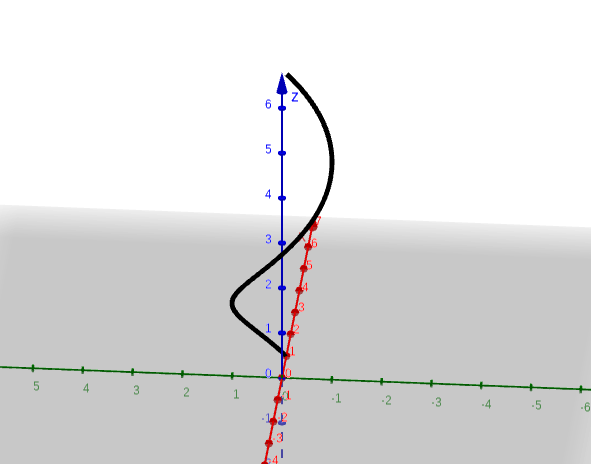
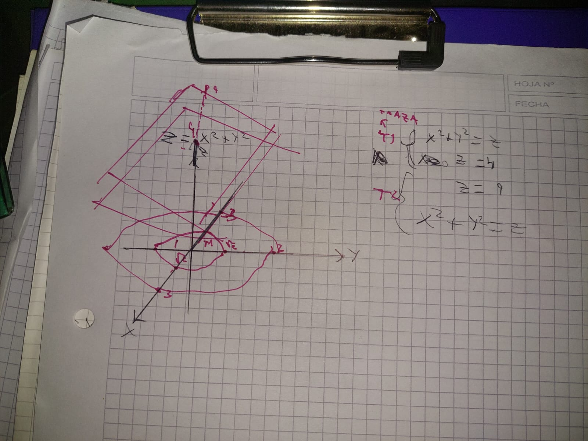

# unidad 2 (funciones vectoriales, curvas y rectas tangentes)

## funciones vectoriales

las funciones vectoriales son funciones que asignan a cada punto de su dominio un vector en un espacio vectorial. Por ejemplo, una función vectorial de una variable real puede asignar a cada número real un vector en el espacio tridimensional.

```math

\mathbf{r}(t) = \langle x(t), y(t), z(t) \rangle
``` 

estas admiten representacion en r2 y r3, y se pueden usar para describir curvas en el espacio.

## curvas

una curva es una función vectorial que describe una trayectoria en el espacio. por ejemplo, la curva dada por:

```math
\mathbf{r}(t) = \langle \cos(t), \sin(t), t \rangle
``` 
describe una hélice en el espacio tridimensional.



## paremtrizacion de curvas

la parametrización de una curva es la forma en que se describe la curva mediante una función vectorial. por ejemplo, la curva dada por:

```math
\mathbf{r}(t) = \langle t, t^2, t^
3 \rangle
```

describe una curva en el espacio tridimensional, y la función vectorial que la describe es su parametrización.

## rectas tangentes

parte de la base de que para una parametrizacion de una curva X(t) = (x(t), y(t), z(t)) para t ∈ [a,b], se dice regural si para cada punto de (a,b) existe y es no nulo un vector x'(t) = (x'(t), y'(t), z'(t)). entonces, la recta tangente a la curva en el punto X(t0) es la recta que pasa por el punto X(t0) y tiene como dirección el vector x'(t0). la ecuación de la recta tangente se puede escribir como:

```math
\mathbf{L}(s) = \mathbf{X}(t_0) + s \mathbf{X}'(t_0)
``` 
donde s es un parámetro que varía a lo largo de la recta. esta recta tangente representa la dirección en la que la curva se mueve en el punto X(t0).

## plano tangente

el plano tangente a una superficie en un punto dado es el plano que toca la superficie en ese punto y es perpendicular a la normal de la superficie en ese punto. para encontrar el plano tangente a una superficie dada por una función z = f(x, y) en un punto (x0, y0, z0), se puede usar la siguiente fórmula:

```math
z - z_0 = f_x(x_0, y_0)(x - x_0) + f_y(x_0, y_0)(y - y_0)
```     

tambien podemos partir de la base de que una recta tangente a una curva en un punto dado es perpendicular a la normal de la curva en ese punto. entonces, para encontrar el plano tangente a una curva dada por una función vectorial r(t) = (x(t), y(t), z(t)) en un punto t0, se puede usar la siguiente fórmula:

```math
\mathbf{f'}(t_0) \cdot (\mathbf{X} - \mathbf{f}(t_0)) = 0
``` 

donde f'(t0) es el vector normal(la derivada) a la curva en el punto t0, y X es un punto cualquiera (en este caso, el vector (X, Y, Z)) en el plano tangente y f(t0) la función evaluada en t0. esta ecuación representa el plano tangente a la curva en el punto t0.

## conjunto de nivel

un conjunto de nivel de una función f(x, y) es el conjunto de puntos (x, y) en el plano que satisfacen la ecuación f(x, y) = c, donde c es una constante. estos conjuntos de nivel representan las curvas de nivel de la función, que son las curvas que conectan los puntos con el mismo valor de la función. por ejemplo, si f(x, y) = x^2 + y^2, entonces el conjunto de nivel para c = 1 sería el círculo dado por la ecuación x^2 + y^2 = 1.

## trazas

las trazas de una función de varias variables son las intersecciones de la gráfica de la función con los planos coordenados. por ejemplo, si tenemos una función f(x, y, z), las trazas serían las curvas obtenidas al fijar una de las variables y variar las otras dos. por ejemplo, la traza en el plano xy se obtiene al fijar z = c, lo que da lugar a la curva dada por f(x, y, c). de manera similar, la traza en el plano xz se obtiene al fijar y = c, lo que da lugar a la curva dada por f(x, c, z), y la traza en el plano yz se obtiene al fijar x = c, lo que da lugar a la curva dada por f(c, y, z). estas trazas pueden proporcionar información valiosa sobre la forma y el comportamiento de la función en diferentes regiones del espacio.



## limites (llegamos aqui otra vez maldita sea)

en una, dos o tres variables, el concepto de límite es fundamental para entender el comportamiento de las funciones cerca de ciertos puntos. por ejemplo, el límite de una función f(x) cuando x se acerca a un valor a se denota como:

```math
    \lim_{x \to a} f(x)
``` 

la definicion formal es la siguiente:

```math
\forall \varepsilon > 0,\ \exists\delta = \delta(\varepsilon) > 0\ \text{tal que, si}\ 0 < |x - x_0| < \delta,\ \text{entonces}\ |f(x) - L| < \varepsilon.
```
si lo miras con ganas esto se puede expresar como existen un l (limite) y un epsilon (distancia al limite) tales que 

```math
L -\varepsilon < f(x) < L + \varepsilon
```

es decir que f(x) se encuentra dentro de un intervalo alrededor de L, y que ese intervalo se puede hacer tan pequeño como queramos al elegir un delta suficientemente pequeño. esto significa que a medida que x se acerca a x0, f(x) se acerca a L, lo que es la esencia del concepto de límite. 

en otras palabras y resumidamente, el limite de consiste en ir acotando desde arriba o abajo de la funcion en el punto un intervalo cada vez mas pequeño, y si ese intervalo se puede acotar cada vez mas cerca de un numero L, entonces decimos que el limite de f(x) cuando x se acerca a x0 es L. este concepto es fundamental para entender la continuidad, la derivabilidad y otros aspectos importantes de las funciones en análisis matemático.

concretamente para que una funcion sea continua en un punto x0, es necesario que el límite de la función cuando x se acerca a x0 sea igual al valor de la función en ese punto, es decir:

```math
\lim_{x \to x_0} f(x) = f(x_0)
```
esto significa que la función no tiene saltos, ni agujeros, ni discontinuidades en ese punto, y que el valor de la función en ese punto coincide con el valor al que se acerca la función a medida que x se acerca a x0. esta es una condición esencial para que una función sea continua en un punto dado.

para el caso de campos escalares es decir de varias variables, el concepto de límite se extiende de manera similar. por ejemplo, para una función f(x, y), el límite cuando (x, y) se acerca a un punto (x0, y0) se denota como:

```math
\lim_{(x, y) \to (x_0, y_0)} f(x, y)
``` 
y la definición formal es análoga a la de una variable:

```math
\forall \varepsilon > 0,\ \exists\delta = \delta(\varepsilon) > 0\ \text{tal que, si}\ 0 < \sqrt{(x - x_0)^2 + (y - y_0)^2} < \delta,\ \text{entonces}\ |f(x, y) - L| < \varepsilon.
```
esto significa que a medida que el punto (x, y) se acerca al punto (x0, y0), la función f(x, y) se acerca al valor L, lo que es la esencia del concepto de límite en varias variables. al igual que en el caso de una variable, el concepto de límite es fundamental para entender la continuidad, la derivabilidad y otros aspectos importantes de las funciones de varias variables en análisis matemático.

## que pasa en funciones vectoriales?

en el caso de funciones vectoriales, el concepto de límite se extiende de manera similar. por ejemplo, para una función vectorial r(t) = (x(t), y(t), z(t)), el límite cuando t se acerca a un valor t0 se denota como:

```math
\lim_{t \to t_0} \mathbf{r}(t) = \mathbf{L}
```

donde cada componente de la función vectorial se acerca a un valor específico.


## como calcular el limite de una funcion de una variable

tenemos varias formas de calcular un limite

1. evaluacion directa: si la función es continua en el punto al que se acerca, simplemente evaluamos la función en ese punto para obtener el límite.

```math
\lim_{x \to a} f(x) = f(a)
```

2. cambio de variable: a veces, al hacer un cambio de variable, podemos simplificar la función y calcular el límite de manera más fácil o usar limite conocido:

```math
\lim_{x \to 0} \frac{\sin(x)}{x} = \lim_{u \to 0} \frac{\sin(u)}{u} = 1
```
3. factorización: si la función tiene una forma que se puede factorizar, podemos factorizarla para simplificarla y luego calcular el límite.

```math
\lim_{x \to 2} \frac{x^2 - 4}{x - 2} = \lim_{x \to 2} \frac{(x - 2)(x + 2)}{x - 2} = \lim_{x \to 2} (x + 2) = 4
```
4. racionalización: si la función tiene una forma que se puede racionalizar, podemos racionalizarla para simplificarla y luego calcular el límite.

```math
\lim_{x \to 0} \frac{\sqrt{x + 1} -
1}{x} = \lim_{x \to 0} \frac{(\sqrt{x + 1} - 1)(\sqrt{x + 1} + 1)}{x(\sqrt{x + 1} + 1)} = \lim_{x \to 0} \frac{x}{x(\sqrt{x + 1} + 1)} = \lim_{x \to 0} \frac{1}{\sqrt{x + 1} + 1} = \frac{1}{2}
```
5. regla de l'hôpital: si el límite tiene una forma indeterminada como 0/0 o ∞/∞, podemos aplicar la regla de l'hôpital, que establece que el límite de una función en una forma indeterminada se puede calcular tomando la derivada del numerador y del denominador por separado y luego calculando el límite de la nueva función.

```math
\lim_{x \to 0} \frac{\sin(x)}{x} = \lim_{x \to 0} \frac{\cos(x)}{1} = 1
``` 
6. teorema del sandwich: si la función que queremos calcular el límite está acotada por dos funciones que tienen el mismo límite en un punto dado, entonces la función también tiene ese mismo límite en ese punto.

```math
    \text{Si}\ g(x) \leq f(x) \leq h(x)     \text{y}\ \lim_{x \to a} g(x) = \lim_{x \to a} h(x) = L,\ \text{entonces}\ \lim_{x \to a} f(x) = L
``` 
7. infinitesimo por acotado: si la función que queremos calcular el límite se puede expresar como el producto de un infinitesimal y una función acotada, entonces el límite de la función es cero.

```math
\text{Si}\ f(x) = g(x)h(x),\ \text{donde}\ \lim_{x \to a} g(x) = 0\ \text{y}\ h(x)\ \text{es acotada},\ \text{entonces}\ \lim_{x \to a} f(x) = 0
```

### algunos limites conocidos

```math
\lim_{x \to 0} \frac{\sin(x)}{x} = 1
```

```math
\lim_{x \to 0} \frac{1 - \cos(x)}{x^2} = \frac{1}{2}
```

```math
\lim_{x \to 0} \frac{e^x - 1}{x} = 1
```

```math
\lim_{x \to 0} \frac{\ln(1 + x)}{x} = 1
```


## como calcular el limite de una funcion de varias variables

el cálculo de límites de funciones de varias variables puede ser más complejo que el de funciones de una variable, ya que el comportamiento de la función puede variar dependiendo de la dirección desde la cual se acerca al punto en cuestión. sin embargo, existen algunas técnicas y estrategias que pueden ayudar a calcular estos límites:

1. Evaluación directa: si la función es continua en el punto al que se acerca, simplemente evaluamos la función en ese punto para obtener el límite.

```math
\lim_{(x, y) \to (a, b)} f(x, y) = f(a, b)
```

2. Cambio de variable: a veces, al hacer un cambio de variable, podemos simplificar la función y calcular el límite de manera más fácil o usar límites conocidos.

```math
\lim_{(x, y) \to (0, 0)} \frac{\sin(x^2 + y^2)}{x^2 + y^2} = \lim_{r \to 0} \frac{\sin(r^2)}{r^2} = 1
``` 

3. Racionalización: si la función tiene una forma que se puede racionalizar, podemos racionalizarla para simplificarla y luego calcular el límite.

```math
\lim_{(x, y) \to (0, 0)} \frac{\sqrt{x^2 + y^2 + 1} - 1}{x^2 + y^2} = \lim_{(x, y) \to (0, 0)} \frac{(\sqrt{x^2 + y^2 + 1} - 1)(\sqrt{x^2 + y^2 + 1} + 1)}{(x^2 + y^2)(\sqrt{x^2 + y^2 + 1} + 1)} = \lim_{(x, y) \to (0, 0)} \frac{1}{\sqrt{x^2 + y^2 + 1} + 1} = \frac{1}{2}
```

4. Regla de l'Hôpital: si el límite tiene una forma indeterminada como 0/0 o ∞/∞, podemos aplicar la regla de l'Hôpital, que establece que el límite de una función en una forma indeterminada se puede calcular tomando la derivada parcial del numerador y del denominador por separado y luego calculando el límite de la nueva función.

```math
\lim_{(x, y) \to (0, 0)} \frac{\sin(x^2 + y^2)}{x^2 + y^2} = \lim_{(x, y) \to (0, 0)} \frac{2x\cos(x^2 + y^2) + 2y\cos(x^2 + y^2)}{2x + 2y} = \lim_{(x, y) \to (0, 0)} \frac{2(x + y)\cos(x^2 + y^2)}{2(x + y)} = \lim_{(x, y) \to (0, 0)} \cos(x^2 + y^2) = 1
```     

5. Teorema del sándwich: si la función que queremos calcular el límite está acotada por dos funciones que tienen el mismo límite en un punto dado, entonces la función también tiene ese mismo límite en ese punto.

```math
\text{Si}\ g(x, y) \leq f(x, y) \leq h(x, y)     \text{y}\ \lim_{(x, y) \to (a, b)} g(x, y) = \lim_{(x, y) \to (a, b)} h(x, y) = L,\ \text{entonces}\ \lim_{(x, y) \to (a, b)} f(x, y) = L
```

6. Infinitesimal por acotado: si la función que queremos calcular el límite se puede expresar como el producto de un infinitesimal y una función acotada, entonces el límite de la función es cero.

```math
\text{Si}\ f(x, y) = g(x, y)h(x, y),\ \text{donde}\ \lim_{(x, y) \to (a, b)} g(x, y) = 0\ \text{y}\ h(x, y)\ \text{es acotada},\ \text{entonces}\ \lim_{(x, y) \to (a, b)} f(x, y) = 0
```

por ultimo si todo falla la mejor opcion, es demostrar que el limite no existe, para eso se pueden usar diferentes caminos de aproximacion al punto en cuestion, y si el limite es diferente dependiendo del camino de aproximacion, entonces el limite no existe.

```math
\text{Si}\ \lim_{(x, y) \to (a, b)} f(x, y) \neq \lim_{(x, y) \to (a, b)} f(x, y),\ \text{entonces}\ \lim_{(x, y) \to (a, b)} f(x, y) \text{no existe}
```

las mas comunes son aproximacion por lineas rectas, es decir, aproximar al punto (a, b) por diferentes lineas rectas que pasen por ese punto, y si el limite es diferente dependiendo de la linea recta de aproximacion, entonces el limite no existe.

```math
\text{Si}\ \lim_{t \to 0} f(a + t, b + mt) \neq \lim_{t \to 0} f(a + t, b + nt),\ \text{para}\ m \neq n,\ \text{entonces}\ \lim_{(x, y) \to (a, b)} f(x, y) \text{no existe}
```

tambien se puede aproximar al punto (a, b) por curvas, es decir, aproximar al punto (a, b) por diferentes curvas que pasen por ese punto, y si el limite es diferente dependiendo de la curva de aproximacion, entonces el limite no existe.

```math
\text{Si}\ \lim_{t \to 0} f(a + t^2, b + t^3) \neq \lim_{t \to 0} f(a + t^3, b + t^2),\ \text{entonces}\ \lim_{(x, y) \to (a, b)} f(x, y) \text{no existe}
``` 

## campo escalar continuo

un campo escalar es una función que asigna un valor escalar a cada punto en el espacio. por ejemplo, la temperatura en una habitación puede ser representada como un campo escalar, donde cada punto en la habitación tiene un valor de temperatura asociado. un campo escalar es continuo si para cada punto en el espacio, el límite del campo escalar cuando se acerca a ese punto es igual al valor del campo escalar en ese punto. esto significa que no hay saltos ni discontinuidades en el campo escalar, y que el valor del campo escalar en un punto dado coincide con el valor al que se acerca el campo escalar a medida que nos acercamos a ese punto.